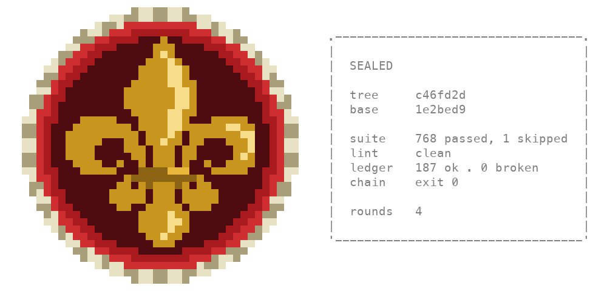
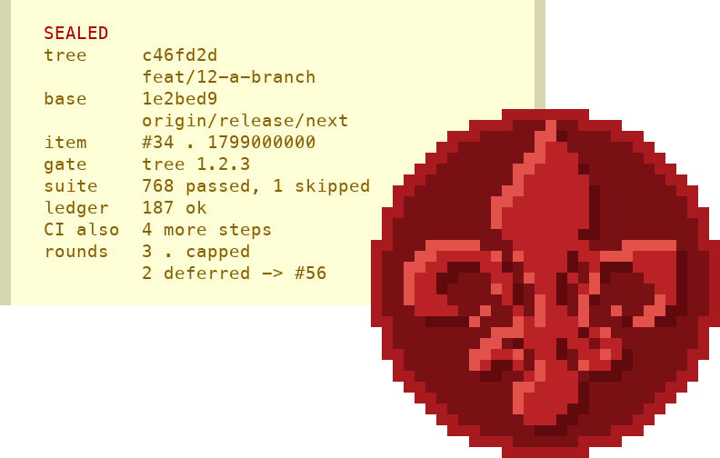

# docs/seals/ — every emblem the broad gate's stamp has carried

The broad gate draws a stamp when a run earns it
(`docs/the-broad-gate.md` §*Where the stamp is drawn*): the panel of what
it read, and a wax disc with an emblem pressed into it. The emblem has
changed since #30 first drew it. This directory keeps each version as the
terminal drew it, so a reader can see an earlier one without checking out
an old tag.

Each entry is two files, and no code reads either of them:

- **`<name>.ans`** — the stamp as a terminal prints it: half-block
  characters and ANSI colour codes, a code only where the colour changes.
  Print it with `cat` in a terminal that draws truecolour.
- **`<name>.png`** — a preview of the same cells for a page that cannot
  print ANSI codes. Each cell is 12 × 24 pixels, a half-block is drawn as
  its two halves, and a cell nothing paints is transparent.

The source of each entry is its tag, not a copy of the old code. The
command under each entry draws it again from the tag. It loads that tag's
`skills/verify/scripts/seal_stamp.py` and calls `stamp(SAMPLE_ROWS,
DEFAULT_SCALE)` directly, because `seal-stamp` on a pipe prints the letter
twin rather than the colours.

## The gold lily — 0.10.0 to 0.16.0



- **Releases:** 0.10.0 through 0.16.0. From 0.15.7 the stamp is drawn at
  0.90 by default (#400); before that, at 1.0. The file is v0.16.0's, at
  0.90.
- **Issue:** #30, through pull request #332. #30 computed the disc from
  its radius, so it cannot be off centre, and the lily was a 29 × 32 chart
  sampled onto it.
- **Draw it again:**

  ```
  git show v0.16.0:skills/verify/scripts/seal_stamp.py | python3 -c 'import sys, types; m = types.ModuleType("seal_stamp"); exec(sys.stdin.read(), m.__dict__); print("\n".join(m.stamp(m.SAMPLE_ROWS, m.DEFAULT_SCALE)))' > gold-lily.ans
  ```

- **Bytes:** v0.16.0's writer sets a colour that is already in force 20
  times. `gold-lily.ans` leaves those 20 codes out, so it is 10,751 bytes
  where the command writes 10,831. Every cell has the same character and
  the same two colours in both.

## The red lily — 0.17.0 to 0.19.0



- **Releases:** 0.17.0 through 0.19.0. The file is v0.19.0's, at its
  default of 0.90.
- **Issue:** #717, through pull request #719. #717 made the stamp a letter
  on a parchment sheet, took the rope and the gold off, and pressed the
  disc over the sheet's corner, so the hook's message fits under the
  harness's size limit again.
- **Draw it again:**

  ```
  git show v0.19.0:skills/verify/scripts/seal_stamp.py | python3 -c 'import sys, types; m = types.ModuleType("seal_stamp"); exec(sys.stdin.read(), m.__dict__); print("\n".join(m.stamp(m.SAMPLE_ROWS, m.DEFAULT_SCALE)))' > red-lily.ans
  ```

- **Bytes:** `red-lily.ans` is exactly what the command writes, 6,455
  bytes.

## The next entry

The emblem that follows the red lily is added when its release is tagged.
The version check in `tests/test_release_hygiene.py` refuses a version at
or above the running one unless a tag names it, so an entry written before
its tag cannot name its release.
