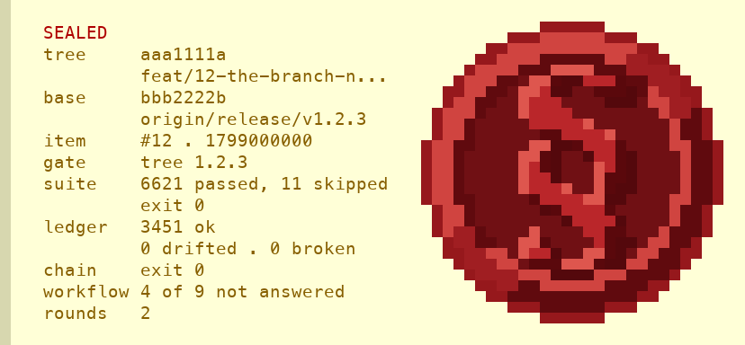
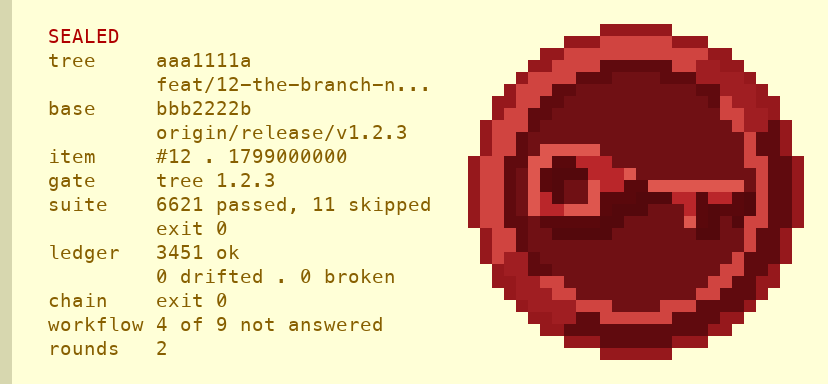
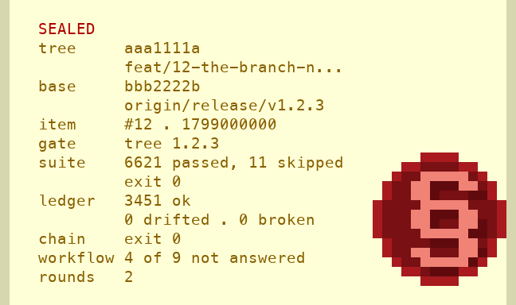

# assets/seals/ — every emblem the broad gate's stamp has carried

The broad gate draws a stamp when a run earns it
(`docs/the-broad-gate.md` §*Where the stamp is drawn*): the panel of what
it read, and a wax disc with an emblem pressed into it. The emblem has
changed since #30 first drew it. This directory keeps each version as the
terminal drew it, so a reader can see an earlier one without checking out
an old tag.

Each entry is two files, and no code reads either of them:

- **`<name>.ans`** — the stamp as a terminal prints it: half-block
  characters and ANSI colour codes, a code only where the colour changes.
  Print it with `cat` in a terminal that draws truecolour.
- **`<name>.png`** — a preview of the same cells for a page that cannot
  print ANSI codes. Each cell is 12 × 24 pixels, a half-block is drawn as
  its two halves, and a cell nothing paints is transparent.

The source of each entry is its tag, not a copy of the old code. The
command under each entry draws it again from the tag. It loads that tag's
`skills/verify/scripts/seal_stamp.py` and calls `stamp(SAMPLE_ROWS,
DEFAULT_SCALE)` directly, because `seal-stamp` on a pipe prints the letter
twin rather than the colours.

## The gold lily — 0.10.0 to 0.16.0


- **Releases:** 0.10.0 through 0.16.0. From 0.15.7 the stamp is drawn at
  0.90 by default (#400); before that, at 1.0. The file is v0.16.0's, at
  0.90.
- **Issue:** #30, through pull request #332. #30 computed the disc from
  its radius, so it cannot be off centre, and the lily was a 29 × 32 chart
  sampled onto it.
- **Draw it again:**

  ```
  git show v0.16.0:skills/verify/scripts/seal_stamp.py | python3 -c 'import sys, types; m = types.ModuleType("seal_stamp"); exec(sys.stdin.read(), m.__dict__); print("\n".join(m.stamp(m.SAMPLE_ROWS, m.DEFAULT_SCALE)))' > gold-lily.ans
  ```

- **Bytes:** v0.16.0's writer sets a colour that is already in force 20
  times. `gold-lily.ans` leaves those 20 codes out, so it is 10,751 bytes
  where the command writes 10,831. Every cell has the same character and
  the same two colours in both.

## The red lily — 0.17.0 to 0.19.0


- **Releases:** 0.17.0 through 0.19.0. The file is v0.19.0's, at its
  default of 0.90.
- **Issue:** #717, through pull request #719. #717 made the stamp a letter
  on a parchment sheet, took the rope and the gold off, and pressed the
  disc over the sheet's corner, so the hook's message fits under the
  harness's size limit again.
- **Draw it again:**

  ```
  git show v0.19.0:skills/verify/scripts/seal_stamp.py | python3 -c 'import sys, types; m = types.ModuleType("seal_stamp"); exec(sys.stdin.read(), m.__dict__); print("\n".join(m.stamp(m.SAMPLE_ROWS, m.DEFAULT_SCALE)))' > red-lily.ans
  ```

- **Bytes:** `red-lily.ans` is exactly what the command writes, 6,455
  bytes.

## The next entry

The emblem that follows the red lily is added when its release is tagged.
The version check in `tests/test_release_hygiene.py` refuses a version at
or above the running one unless a tag names it, so an entry written before
its tag cannot name its release.

## Candidates for #857

The stamp that follows the red lily keeps a disc whose frame the owner
settled on 2026-10-07: 28 cells across, a wax edge, a rim lit from the
upper left, a groove and the field. Its mark is a placeholder, Georgia
Bold's S, held as one chart: `skills/verify/scripts/seal-mark.txt`, 28 lines
of 28 characters over `.M`. What the mark becomes is #857. The owner looked
at these three the same day and shipped none of them; they wait here for
#857.

Each candidate is three files, and no code reads any of them:

- **`<name>.txt`** — the mark as a chart: `M` where the mark is pressed,
  `.` where the field shows.
- **`<name>.ans`** — the stamp the owner looked at, its caption line
  dropped and its colour codes written only where something changes, so a
  terminal prints it whole. Every cell is the one the owner saw.
- **`<name>.png`** — a preview of the `.ans`, drawn by the rule above.

**All three stand on the parchment sheet, which the owner retired the same
day.** The stamp that ships has no sheet: the disc stands at the left and
the text beside it in the terminal's own colours. So only a candidate's
disc is a candidate; its sheet and the shape of its rows are history.

**A 28-cell chart becomes the mark by replacing `seal-mark.txt` with it.**
`read_chart` reads that file when the stamp module loads, and refuses one
that is not 28 lines of 28 over `.M` or that marks a cell outside the field,
with a sentence naming the line and the column.

### The § at 28 cells — `section-28`



- **What it is:** Georgia Bold's §, fitted to the 28-cell frame, in the
  red lily's three tones with a drop shadow.
- **Drawn by:** the orchestrating session's reference renderer over a
  sample panel, not by `seal_stamp.py`. No tag draws it again.
- **Its chart is refused as it stands.** Three `M` cells of its first
  marked line, line 5 at columns 12, 17 and 18, lie in the disc's groove.
  The reference renderer painted the groove over them, so the `.ans` shows
  the mark without them, and `read_chart` refuses the chart until they are
  dropped.

### The key at 28 cells — `key-28`



- **What it is:** a key lying flat, bow at the left, fitted to the 28-cell
  frame in the same tones.
- **Drawn by:** the same reference renderer over the same sample panel.
  No tag draws it again.
- **Its chart is accepted as it stands**, and the `.ans` shows every `M`
  of it.

### The light-red § at 14 cells — `section-14-light-red`



- **What it is:** a hand-drawn 7 × 10 chart of the § in one light red,
  (240, 130, 118), with a one-cell shadow, on a 14-cell disc of four flat
  colours, standing inside the sheet against its right edge. The owner
  printed it and accepted it, then chose the 28-cell frame the same day.
- **Where it was:** the stamp this work item drew from 35277597 until
  32e257f7 replaced it. No release carried it.
- **Its chart** is the 14 × 14 grid the 7 × 10 chart filled at 35277597,
  two lines down and four columns in. It is not a 28-cell chart, so
  `read_chart` refuses it, and #857's own lesson is that a mark scaled by
  ratio smears: it would be redrawn for 28 cells, not enlarged.
- **Draw it again:** the `.ans` is that commit's stamp over the hook test
  module's `FULL_ROWS`, the real `fitted` panel the owner printed. The
  command writes 3,002 bytes where the file holds 2,954, because the file
  writes a code only where something changes; every cell is the same.

  ```
  python3 -c 'import ast, subprocess, types; show = lambda p: subprocess.run(["git", "show", "35277597:" + p], capture_output=True, encoding="utf-8").stdout; m = types.ModuleType("seal_stamp"); exec(show("skills/verify/scripts/seal_stamp.py"), m.__dict__); rows = next(ast.literal_eval(n.value) for n in ast.parse(show("tests/test_the_stamp_reaches_the_person_it_is_drawn_for.py")).body if isinstance(n, ast.Assign) and getattr(n.targets[0], "id", "") == "FULL_ROWS"); print("\n".join(m.stamp(rows, m.DEFAULT_SCALE)))' > section-14-light-red.ans
  ```
